# BoaTico2Go

  

___

Programa hecho en Matlab usando App Designer, para simular el software de una empresa ficticia ( BoaTico2Go ) que construye mecanismos para levantar botes en diferentes materiales. Este mecanismo se diseño como un 4 barras tipo 2, con unos angulos iniciales de trabajo seleccionados a conveniencia.  
 
El mismo analiza lo siguiente:
* Fuerzas presentes en cada una de las uniones
* Esfuerzos presentes en cada una de las uniones
* Muestra estos datos para cualquier posicion en la que se encuentre el mecanismo
* Torque de entrada necesario
* Costo de la construcción
* Dando resultados en diferentes materiales para comparar
 

Al introducir los siguientes datos:  
* Dimensiones del bote
* Peso del bote
* Material del que desea construir el mecanismo ( El programa tiene las opciones de material )
* Velocidad o aceleración angular de entrada
 
 

## Como se Utiliza?
---
1. Se debe tener instalado Matlab. Para iniciar el programa dar doble click al mismo en la carpeta donde se ubique.  
  
 

1. Se abrira el programa listo para utilizar. Se deben introducir los datos iniciales que se solicitan en la pestaña Datos.  
  
1. Introduzca el nombre del cliente.  
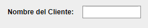 
1. Introduzca las dimensiones de su bote.  
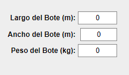  
1. Seleccione el material con el que desea diseñar el mecanismo levanta botes.  
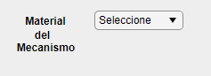  
1. Seleccione si desea introducir la velocidad o la aceleración angular por medio del interruptor.  
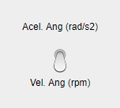  
1. Seleccione la magnitud respectiva del valor de entrada anterior por medio del selector giratorio.  
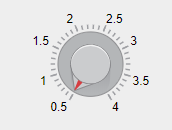 
1. Cuando se hayan introducido los datos se debe hacer click en el boton _Diseñar mi Mecanismo_.  
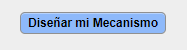
 
1. En la pestaña **Mecanismo** se presenta la imagen de la maqueta o prototipo que se diseño, una imagen de la simulación y los señalamientos de referencia utiles para una mejor comprensión del analisis.  
Se describen detalles del diseño y posteriormente los momentos de inercia correspondientes.  
**Nota:** El programa puede tardar en obtener los resultados debido a la complejidad de los calculos.  
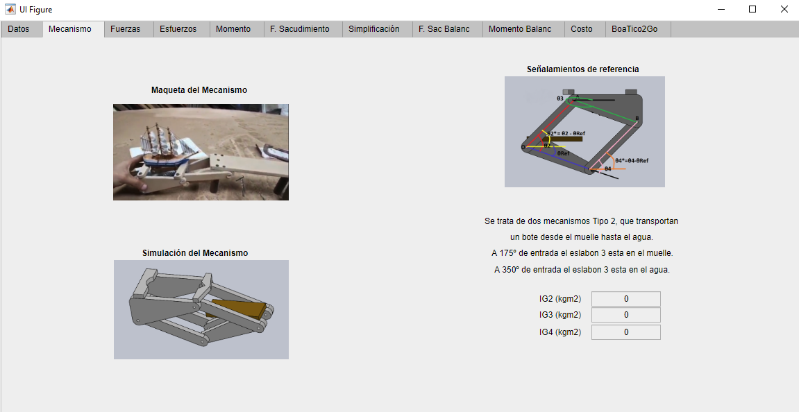 
1. En la pestaña **Fuerzas**, se muestran las magnitudes de las fuerzas que afectan diferentes puntos del mecanimo. Al lado derecho superior se puede seleccion la posición ( angulo ) para el cual se desean conocer las magnitudes.  
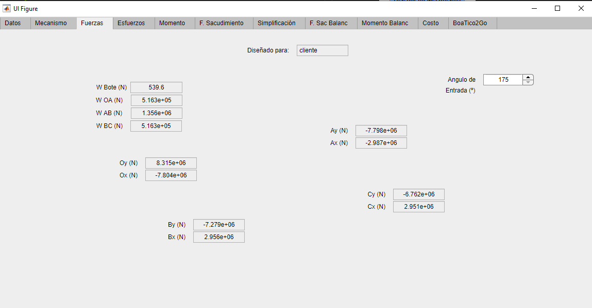
 
1. En la pestaña **Esfuerzos**, se muestran las magnitudes de los esfuerzos que afectan diferentes puntos del mecanimo. Al lado derecho superior se puede seleccion la posición ( angulo ) para el cual se desean conocer las magnitudes.  
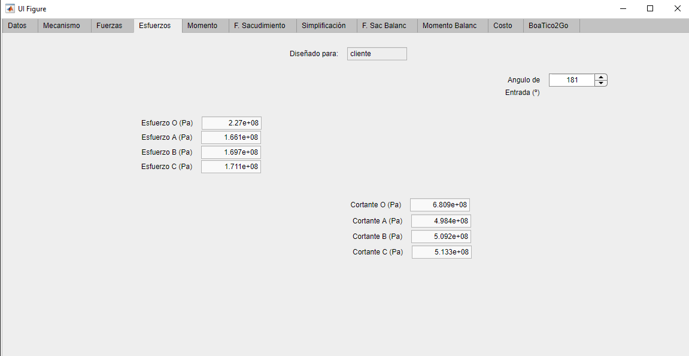
 
1. En la pestaña **Momento**, se muestran la magnitud del momento de entrada. Al lado derecho superior se puede seleccion la posición ( angulo ) para el cual se desea conocer la magnitud.  
Abajo se grafica el momento de entrada en función del angulo de entrada.  
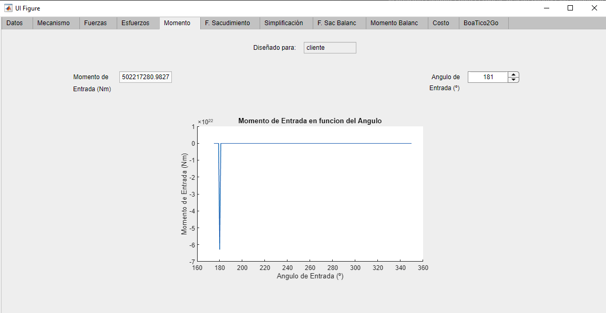
 
1. En la pestaña **F. Sacudimiento**, se muestran gráficas con las fuerzas de sacudimiento en función del angulo de entrada para los puntos denominados O y C. 
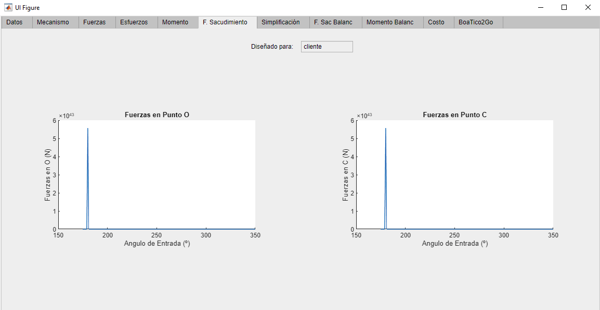
 
1. En la pestaña **Simplificación**, se muestran las magnitudes correspondientes al analisis del mecanimo de manera simplificada. 
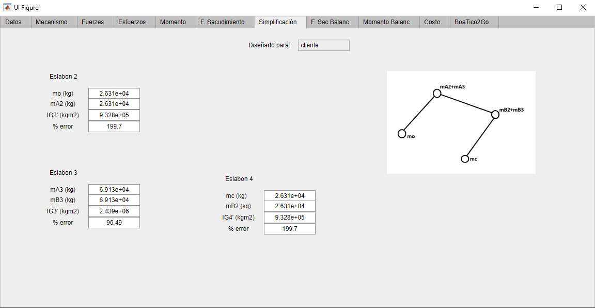
 
1. En la pestaña **F. Sac. Balanc**, se muestran gráficas con las fuerzas de sacudimiento del mecanismo balanceado en función del angulo de entrada para los puntos denominados O y C. 
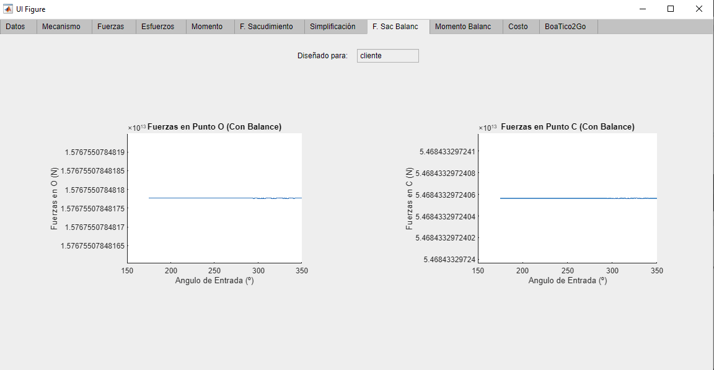
 
1. En la pestaña **Momento Balanc**, se muestra la gráfica del momento de entrada correspondiente según el angulo de entrada para el caso del mecanismo balanceado. 
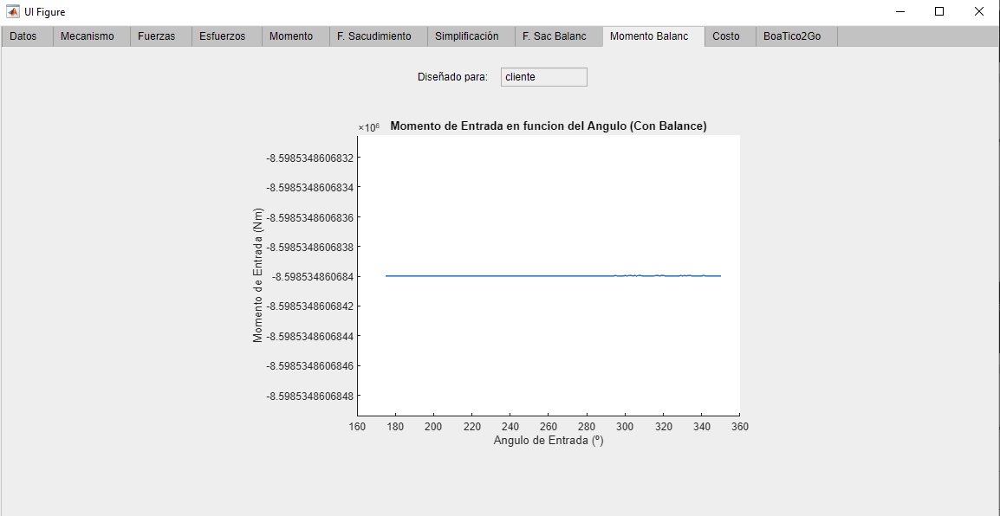
 
1. En la pestaña **Costo**, se muestra la masa necesaria para la elaboración del producto, el costo en colones por kilogramo y el costo final considerando honorarios. 
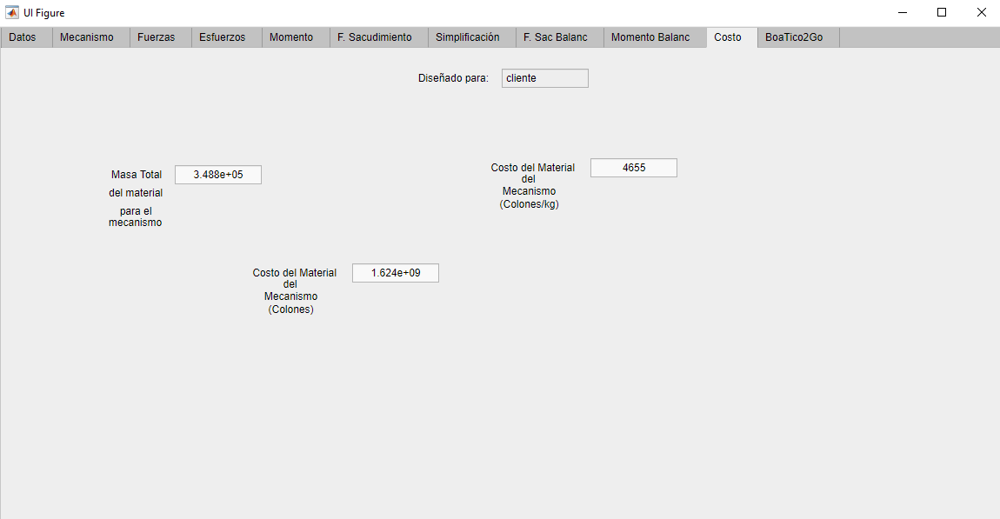
 
1. En la pestaña **BoaTico2Go**, se deja el contacto a la "empresa". 
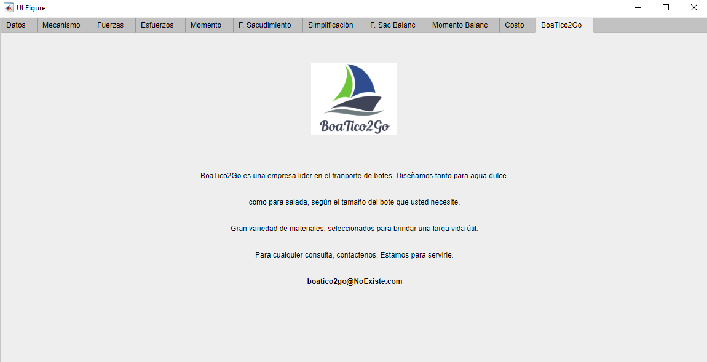
 

___
___