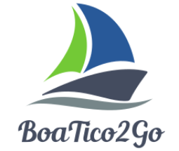

# BoaTico2Go

  

___

Programa hecho en Matlab usando App Designer, para simular el software de una empresa ficticia (BoaTico2Go) que construye mecanismos para levantar botes en diferentes materiales.  
 
El mismo analiza lo siguiente:
* Fuerzas presentes en cada una de las uniones
* Esfuerzos presentes en cada una de las uniones
* Muestra estos datos para cualquier posicion en la que se encuentre el mecanismo
* Torque de entrada necesario
* Costo de la construcción
* Dando resultados en diferentes materiales para comparar
 

Al introducir los siguientes datos:  
* Dimensiones del bote
* Peso del bote
* Material del que desea construir el mecanismo ( El programa tiene las opciones de material)
* Velocidad y aceleración angular de entrada
 
 

## Como se Utiliza?
---
1. Se debe tener instalado Matlab. Para iniciar el programa dar doble click al mismo en la carpeta donde se ubique.  

  

 